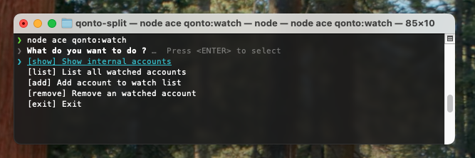

<a name="readme-top"></a>

<!-- PROJECT LOGO -->
<br />
<div align="center">
  <a href="https://github.com/underscore-blank/qonto-split">
    
  </a>

  <h3 align="center">qonto-split</h3>

  <p align="center">
    Split your Qonto incomes automatically to an internal account.
    <br />
    <a href="https://github.com/underscore-blank/qonto-split/issues/new?labels=bug">Report Bug</a>
    ·
    <a href="https://github.com/underscore-blank/qonto-split/issues/new?labels=enhancement">Request Modification</a>
  </p>
</div>

<!-- TABLE OF CONTENTS -->
<details>
  <summary>Table of Contents</summary>
  <ol>
    <li>
      <a href="#about-the-project">About The Project</a>
      <ul>
        <li><a href="#built-with">Built With</a></li>
      </ul>
    </li>
    <li>
      <a href="#getting-started">Getting Started</a>
      <ul>
        <li><a href="#getting-started_prerequisites">Prerequisites</a></li>
        <li><a href="#getting-started_installation">1. Installation</a></li>
        <li><a href="#getting-started_environment">2. Environment variables</a></li>
        <li><a href="#getting-started_setup">3. Setup</a></li>
        <li><a href="#getting-started_manual_run">4. Manual Run</a></li>
        <li><a href="#getting-started_auto_run">5. Scheduled Run (Cron-like)</a></li>
      </ul>
    </li>
    <li>
      <a href="#commands">Commands</a>
      <ul>
        <li><a href="#commands_watch"><code>qonto:watch</code> - Manage watched accounts</a></li>
        <li><a href="#commands_exclude"><code>qonto:exclude</code> - Manage excluded accounts</a></li>
      </ul>
    </li>
    <li><a href="#contact">Contact</a></li>
  </ol>
</details>

<!-- ABOUT THE PROJECT -->

## About The Project

Qonto Split est un outil permettant de répartir automatiquement les revenus de votre compte Qonto sur un compte interne. 
L'usage initial a été pensé pour répartir le montant de TVA entrant sur un sous-compte afin d'éviter une sur-utilisation
de trésorerie et une provision constante pour assurer son versement. Pour autant, il est utilisable également pour 
répartir un pourcentage fixe d'un montant entrant (calcule different de la TVA). Cette fonctionnalité n'est pas 
disponible sur Qonto.

### Built With

-   [![TypeScript][TypeScript]][TypeScript-url]
-   [![AdonisJS][AdonisJS]][AdonisJS-url]

<p align="right">(<a href="#readme-top">back to top</a>)</p>

<!-- GETTING STARTED -->

## Getting Started

Nous allons vous guider étapes par étapes pour commencer à utiliser `qonto-split`.

### <span id="getting-started_prerequisites">Prerequisites</span>

Nous ❤️ `pnpm` pour gérer les dépendances du projet. Vous pouvez l'installer avec `npm` ou `yarn`. Si vous ne l'avez
pas, utilisez la commande suivante ou référez vous à la [documentation](https://pnpm.io/installation) de `pnpm` pour plus d'informations.
```sh
npm install -g pnpm@latest-10
```

### <span id="getting-started_installation">1. Installation</span>

Commencez par exécuter les commandes suivantes pour récupérer le projet sur votre machine :

1. Clone the repo (using HTTPS or SSH)
    ```sh
    git clone https://github.com/underscore-blank/qonto-split.git
    ```
2. Go to the project directory
    ```sh
    cd qonto-split
    ```
3. Install packages dependencies
    ```sh
    pnpm install
    ```
4. Copy the `.env.example` file to `.env`
    ```sh
    cp .env.example .env
    ```
5. Generate the application key
    ```sh
    pnpm run generate:key
    ```
   
<p align="right">(<a href="#readme-top">back to top</a>)</p>
   
### <span id="getting-started_environment">2. Environment variables</span>

Définissez toutes les variables environment dans le fichier `.env` à la racine du projet. Vous devriez avoir quelque
chose de la sorte une fois complété. Le `NODE_ENV` à une influence sur le comportement de l'application : 

- `development` : Toutes les commandes sont exécutés en dry-run et **aucun virement n'est effectué**.
- `production` : Les commandes sont exécutés normalement et les virements sont effectués.

Pour récupérer vos credentials, rendez-vous sur [Qonto](https://app.qonto.com) et récupérez votre clé secrète et 
l'identifiant de votre organisation : Settings (Cog Icon) > Intégrations et Partenariats > Clé API.

```env
TZ=UTC
PORT=3333
HOST=localhost
LOG_LEVEL=info
APP_KEY=RzsLKGzEC3xQVLYG64vfifRkDMz4VVgk # Your app key may be different
NODE_ENV=development # Set as production for production environment

QONTO_API_BASE_URL=https://thirdparty.qonto.com/
QONTO_SECRET_KEY=YOUR_QONTO_SECRET_KEY # Your Qonto secret key
QONTO_ORGANIZATION_SLUG=YOUR_QONTO_ORGANIZATION_SLUG # Your Qonto organization slug
```

<p align="right">(<a href="#readme-top">back to top</a>)</p>

### <span id="getting-started_setup">3. Setup</span>

Vous allez maintenant définir la configuration de l'application. Si vous avez besoin de modifier la configuration il 
vous suffira d'utiliser cette commande à nouveau. Laissez-vous ensuite guider à travers la configuration intéractive.
Le setup vous proposera de configurer les watched accounts et les IBAN à exclure si vous souhaitez le faire plus tard
consultez la section [commands](#commands) pour plus d'informations.

**Informations additionnelles :**
- **Reference for withdrawal :** La référence qui sera utilisée pour les virements. Elle est utilisée pour que vous 
  puissiez identifier les virements effectués par l'application. Par défaut : `Internal Transfer - Qonto Split`.
- **Split amount :** Le pourcentage du montant à transférer sur le compte interne. Entrez le nombre sans le symbole `%`.
- **VAT mode :** Change le mode de calcul pour le montant à transférer. Si vous utilisez le mode TVA, le montant 
  transféré sera calculé en fonction du montant de **Split amount**. Si vous utilisez le mode fixe, le montant transféré 
  sera calculé en fonction du pourcentage du montant entrant.
- **Exclude internal incomes :** Si vous souhaitez exclure les virements internes de la répartition, activez cette option.

**Formulaire de configuration :**


**Pour lancer le setup, exécutez la commande suivante :**
```sh
node ace qonto:setup
```

<p align="right">(<a href="#readme-top">back to top</a>)</p>

### <span id="getting-started_manual_run">4. Manual Run</span>

Si vous souhaitez exécuter l'application manuellement, vous pouvez le faire en utilisant la commande suivante.

**Options :**
- `--interactive` ou `-i` : Active le mode intéractif pour les virements. Vous pourrez voir les détails des virements 
   avant de les effectuer. Default : `false`.
- `--dry` : Exécute les commandes en mode dry-run. Aucun virement ne sera effectué. Default activated if
   `NODE_ENV=development`.
- `--interval[=value]` : Définit un interval de temps pour la récupération des transactions. Valeurs possibles : 
  - `year`
  - `quarter`
  - `month` 
  - `week` (default)
  - `day` 
  - `hour` 
  - `minute`

**Pour lancer l'application manuellement, exécutez la commande suivante :**
```sh
node ace qonto:split --interactive
```
  
<p align="right">(<a href="#readme-top">back to top</a>)</p>

### <span id="getting-started_auto_run">5. Scheduled Run (Cron-like)</span>

Vous pouvez choisir d'exécuter l'application de manière automatique quotidiennement afin de répartir les revenus de
votre compte Qonto sans vous soucier de lancer l'application manuellement. Pour cela, nous avons ajouté une
configuration `pm2`. Vous pouvez lancer l'application en mode production avec la commande suivante :

```sh
pm2 start scheduler.config.cjs && pm2 save
```

> Vous pouvez modifier la configuration de `pm2` en éditant le fichier [`scheduler.config.cjs`](./scheduler.config.cjs) 
> à la racine du projet.

<p align="right">(<a href="#readme-top">back to top</a>)</p>

<!-- COMMANDS -->

## Commands

Des commandes supplémentaires sont disponibles pour vous aider à gérer la configuration l'application. Ou si vous ne
souhaitez pas relancer le processus de setup en entier.

### <span id="commands_watch">`qonto:watch` - Manage watched accounts</span>

Cette commande vous permet de gérer les comptes surveillés par l'application. Vous pouvez ajouter ou supprimer des
comptes à surveiller. Les comptes surveillés sont utilisés pour récupérer les transactions et les virements entrants.



**Run with the following command :**
```sh
node ace qonto:watch
```

<p align="right">(<a href="#readme-top">back to top</a>)</p>

### <span id="commands_exlude">`qonto:exclude` - Manage excluded accounts</span>

Cette commande vous permet de gérer les comptes à exclure de la répartition. Les comptes exclus ne seront pas pris en
compte lors de la répartition des revenus. Toutes les transactions provenant de ces comptes seront ignorées.


**Run with the following command :**
```sh
node ace qonto:exclude
```

<p align="right">(<a href="#readme-top">back to top</a>)</p>

<!-- CONTACT -->

## Contact

-   Kylian Mallet - [@Kylian-Mallet](https://github.com/Kylian-Mallet) - [kylian.mallet@sklav.group](mailto:kylian.mallet@sklav.group)
-   Guillaume Varin - [@GullmeVrn](https://github.com/GullmeVrn) - [guillaume.varin@sklav.group](mailto:guillaume.varin@sklav.group)

<p align="right">(<a href="#readme-top">back to top</a>)</p>

<!-- MARKDOWN LINKS & IMAGES -->
<!-- https://www.markdownguide.org/basic-syntax/#reference-style-links -->

[product-screenshot]: .github/assets/screenshot.jpeg
[AdonisJS]: https://img.shields.io/badge/AdonisJS-5468FF?style=for-the-badge&logo=adonisjs&logoColor=whtie
[AdonisJS-url]: https://adonisjs.com/
[TypeScript]: https://img.shields.io/badge/typescript-3178C6?style=for-the-badge&logo=typescript&logoColor=white
[TypeScript-url]: https://www.typescriptlang.org/
